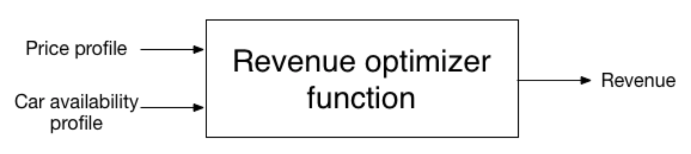

# Parallel Aggregator model 

## Introduction
The contents of this folder are two-fold: 

- Test a simple model of an Electric Vehicle aggregator that dispatches a fleet according to prices. 
- Develop a self contained implementation of Julia's ```CPLEX.jl``` module that can run in [UC Berkeley's Savio cluster](http://research-it.berkeley.edu/services/high-performance-computing/user-guide)

This is work in progress and the current version of the implementation works as follows: 

- CPLEX binary files are locally stored in a folder at the server, this folder is ignored in the repository. 

- The folder ```julia_cplex``` contains the modified version of the [CPLEX module](https://github.com/JuliaOpt/CPLEX.jl). The modifications are minor and intended to redirect the module to the CPLEX libraries stored locally instead of searching for the paths in operating system. 

- The file ```add_solver.jl``` is intended to create the file ```deps.jl``` that directs CPLEX module to the shared libraries stored in CPLEX's *bin* folder.

- In order to use the local version of the module files, I used these two lines to tell the aggregator file ```aggregatorv1.jl``` to look for the module locally 
~~~ Julia
cplex_path = "../julia_cplex")
push!(LOAD_PATH, cplex_path)
~~~

## Aggregator model. 

- Two versions of the model are stored in each respective folder. Single fleet dispatches the EVs considering one type of fleet behavior. Multiple fleet dispatches the EV's considering different types of behaviours. 

