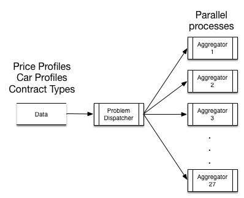

The model was coded in the programming language Julia,  and solved using Gurobi as the MILP solver. The process described here developed to use UC Berkeley’s Savio cluster in order to tackle the complexity of running a large scale optimization problem for all the scenarios. 

The system was configured such that a problem dispatcher will assign to each one of the 27 aggregator models the respective data and spawn parallel solution processes. The implementation is shown in
 

