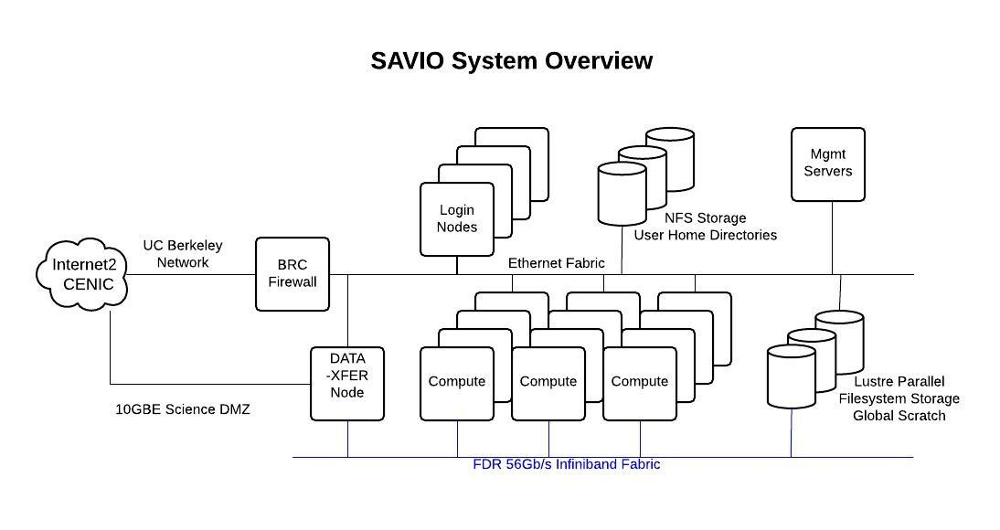

# Using Julia with Savio Cluster

Please use this document as a list of alternatives to use the savio cluster from UC Berkeley in combination of the programming language Julia. 

The examples are motivated from the numerical methods literature and the main intention is to provide guidance on implementation. The instructions and applications are geared towards HPC applications, namely complicated problems that require large parallelization. 

The files in this folder are barebone files that can be used to develop implementations for particular problems. Savio uses the [https://en.wikipedia.org/wiki/Slurm_Workload_Manager] (Slurm Workload Manager) and dispatches jobs using bash files. The repository contains several ```*.sh``` files depending on the application and this readme file contains a catalog to help with the choice. 

## Notes about Savio's operation 

% Savio introductory training: Basic usage of the Berkeley Savio high-performance computing cluster
% August 2, 2016

I have copied this file from the Savio introductory training August 2, 2016 because it explain very well how Savio works. The original source is [This file](https://github.com/ucberkeley/savio-training-intro-2016/blob/master/intro.md)

Much of this material is based on the extensive Savio documention we have prepared and continue to prepare, available at [http://research-it.berkeley.edu/services/high-performance-computing/user-guide](http://research-it.berkeley.edu/services/high-performance-computing/user-guide).

### System capabilities and hardware

- Savio is a 335-node, >7000-core Linux cluster rated at 200 peak teraFLOPS. 
   - ~162 compute nodes provided by the institution for general access
   - ~161 compute nodes contributed by researchers in the Condo program
   - 50 nodes in the process of being added

Let's take a look at the hardware specifications of the computing nodes on the cluster [(see the *Hardware Configuration* section of this document)](http://research-it.berkeley.edu/services/high-performance-computing/user-guide).

The nodes are divided into several pools, called partitions. These partitions have different restrictions and costs associated with them [(see the *Configuration Details* section of this document)](http://research-it.berkeley.edu/services/high-performance-computing/user-guide). Any job you submit must be submitted to a partition to which you have access.

##### Disk space options (home, scratch, project, condo storage)

You have access to the following disk space, described [here in the *Storage and Backup* section](http://research-it.berkeley.edu/services/high-performance-computing/user-guide).

When reading/writing data to/from disk, unless the amount of data is small, please put the data in your scratch space at `/global/scratch/SAVIO_USERNAME`. The system is set up so that disk access for all users is optimized when users are doing input/output (I/O) off of scratch rather than off of their home directories. Doing I/O with files on your home directory can impact the ability of others to access their files on the filesystem. 

We are also making available disk space for purchase via a new *condo storage* offering. The minimum purchase will likely be around $14,000, which will provide roughly 40 TB for five years, but the exact details are still being worked out.


#### Login nodes, compute nodes, and DTN nodes 

Savio has a few different kinds of nodes:

 - login nodes: for login and non-intensive interactive work such as job submission and monitoring, basic compilation, managing your disk space
 - data transfer nodes: for transferring data to/from Savio
 - compute nodes: for computational tasks


<center></center>

### Using Savio
#### Logging in

To login, you need to have software on your own machine that gives you access to a UNIX terminal (command-line) session. These come built-in with Mac (see `Applications -> Utilities -> Terminal`). For Windows, some options include [PuTTY](http://www.chiark.greenend.org.uk/~sgtatham/putty/download.html).

You also need to set up your smartphone or tablet with *Google Authenticator* to generate one-time passwords for you.

Here are instructions for [doing this setup, and for logging in](http://research-it.berkeley.edu/services/high-performance-computing/logging-savio).

Then to login:
```
ssh SAVIO_USERNAME@hpc.brc.berkeley.edu
```

Then enter XXXXXYYYYYY where XXXXXX is your PIN and YYYYYY is the one-time password. YYYYYY will be shown when you open your *Google authenticator* app on your phone/tablet.

One can then navigate around and get information using standard UNIX commands such as `ls`, `cd`, `du`, `df`, etc.

If you want to be able to open programs with graphical user interfaces:
```
ssh -Y SAVIO_USERNAME@hpc.brc.berkeley.edu
```

To display the graphical windows on your local machine, you'll need X server software on your own machine to manage the graphical windows. For Windows, your options include *eXceed* or *Xming* and for Mac, there is *XQuartz*.

#### Software modules

A lot of software is available on Savio but needs to be loaded from the relevant software module before you can use it.

```
module list  # what's loaded?
module avail  # what's available
```

One thing that tricks people is that the modules are arranged in a hierarchical (nested) fashion, so you only see some of the modules as being available *after* you load the parent module. Here's how we see the Python packages that are available.

```
which python
python

module avail
module load python/2.7.8
which python
module avail
module load numpy
python 
# import numpy as np
```

Similarly, we can see that linear algebra, FFT, and HDF5/NetCDF software is available only after loading either the intel or gcc modules.

```
module load intel
module avail
module swap intel gcc
module avail
```

#### How to get additional information about Savio
 - For questions about computing resources in general, including cloud computing: 
    - brc@berkeley.edu


## Implementantion of parallel code on a single node 


## Interactive Julia session

```srun --unbuffered --partition=savio --qos=savio_normal --account=ac_scsguest --time=00:30:00 bash -i```

## Implementation of parallel code on several nodes 


## Implementation including compilation of the Julia files for faster deployment. 


